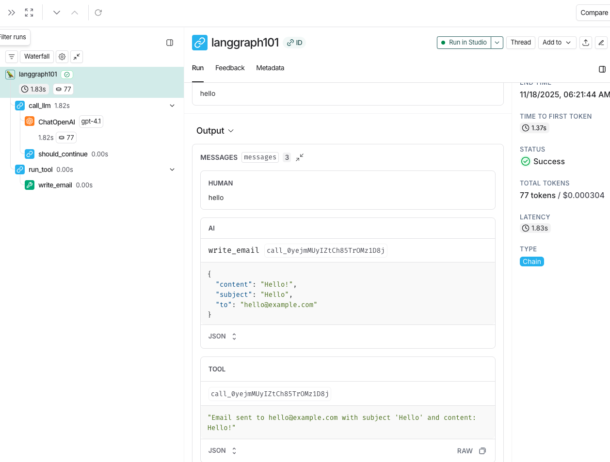

*** Evidence ***


## Environment Setup 

### Python Version

* Ensure you're using Python 3.11 or later. 
* This version is required for optimal compatibility with LangGraph. 

```shell
python3 --version
```

### API Keys

* If you don't have an OpenAI API key, you can sign up [here](https://openai.com/index/openai-api/).
* Sign up for LangSmith [here](https://smith.langchain.com/).
* Generate a LangSmith API key.

### Set Environment Variables

* Create a `.env` file in the root directory:
```shell
# Copy the .env.example file to .env
cp .env.example .env
```

* Edit the `.env` file with the following:
```shell
LANGSMITH_API_KEY=your_langsmith_api_key
LANGSMITH_TRACING=true
LANGSMITH_PROJECT="interrupt-workshop"
OPENAI_API_KEY=your_openai_api_key
```

* You can also set the environment variables in your terminal:
```shell
export LANGSMITH_API_KEY=your_langsmith_api_key
export LANGSMITH_TRACING=true
export OPENAI_API_KEY=your_openai_api_key
```

### Package Installation

**Recommended: Using uv (faster and more reliable)**

```shell
# Install uv if you haven't already
pip install uv

# Install the package with development dependencies
uv sync --extra dev

# Activate the virtual environment
source .venv/bin/activate
```

**Alternative: Using pip**

```shell
$ python3 -m venv .venv
$ source .venv/bin/activate
# Ensure you have a recent version of pip (required for editable installs with pyproject.toml)
$ python3 -m pip install --upgrade pip
# Install the package in editable mode
$ pip install -e .
```